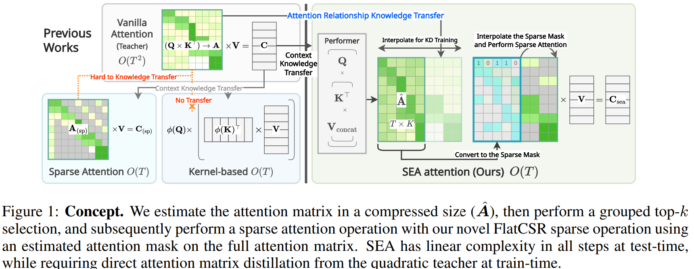

# SEA: Sparse Linear Attention with Estimated Attention Mask



This repository inlcudes official implementations for [SEA](https://openreview.net/forum?id=JbcwfmYrob).

`perlin` is the codename of `SEA-attention`.

> **[SEA: Sparse Linear Attention with Estimated Attention Mask](https://openreview.net/forum?id=JbcwfmYrob)**<br>
> :school:[Heejun Lee](https://github.com/gmlwns2000), :school:[Jina Kim](https://www.linkedin.com/in/jina-kaist-cs-undergrad), :school:[Jeffery Willette](https://jeffwillette.github.io/), :school::robot:[Sung Ju Hwang](http://www.sungjuhwang.com/) <br>
> KAIST :school:, [DeepAuto.ai](http://deepauto.ai/):robot:<br>
> Internation Conference on Learning Representation (ICLR) 2024

## Introduction


Our SEA attention method estimated the pre-trained attention probability in compressed size (down-scale the attention matrix into constant width). 
As you can see in the above figure, first, we estimate the attention probability for each query vector toward the key sequence within constant length `K,` which means token length for mask estimation. 
After estimating the attention probability using the learned predictor network (CNN), we perform the grouped top-k selection described in the paper. 
After converting the estimated attention into the estimated mask, we interpolate the estimated mask to a sparse attention mask to match the causal attention mask. 
We implemented this special interpolation of images using OpenAI Triton. 
Since the interpolated sparse attention mask will contain intended to have the same number of non-zero elements for each query, the interpolation and sparse attention mask will cost only linear complexity.

## Abstract

The transformer architecture has made breakthroughs in recent years on tasks which require modeling pairwise relationships between sequential elements, as is the case in natural language understanding. However, transformers struggle with long sequences due to the quadratic complexity of the attention operation, and previous research has aimed to lower the complexity by sparsifying or linearly approximating the attention matrix. Yet, these approaches cannot straightforwardly distill knowledge from a teacher’s attention matrix, and often require complete retraining from scratch. Furthermore, previous sparse and linear approaches may also lose interpretability if they do not produce full quadratic attention matrices. To address these challenges, we propose SEA: Sparse linear attention with an Estimated Attention mask. SEA estimates the attention matrix with linear complexity via kernel-based linear attention, then creates a sparse approximation to the full attention matrix with a top-k selection to perform a sparse attention operation. For language modeling tasks (Wikitext2), previous linear and sparse attention methods show roughly two-fold worse perplexity scores over the quadratic OPT-1.3B baseline, while SEA achieves an even better perplexity than OPT-1.3B, using roughly half as much memory as OPT-1.3B. Moreover, SEA maintains an interpretable attention matrix and can utilize knowledge distillation to lower the complexity of existing pretrained transformers. We believe that our work will have a large practical impact, as it opens the possibility of running large transformers on resource-limited devices with less memory.

## Results


|      | LLaMA 13B | SEA 13B |
|------|-----------|---------|
| MMLU | 4.682     | 5.446   |
> SEA trained on OpenWebText with 2,000 optimizer steps. This MMLU result is reported by [Geon Park](https://scholar.google.co.kr/citations?user=aJu-QCsAAAAJ&hl=ko)! Thank you for your contribution.

## How-to reproduce

```sh 
# to run opt variants using deepspeed and multi-gpus
# opt-125m and 350m are tuned for 11GB VRAM; opt-1.3b and opt-2.7b are tuned for 24GB VRAM;
./scripts/opt.py --help
# to run opt variants without deepspeed
python -m src.trainer.perlin_trainer --help
# to run bert variants
python -m src.trainer.perlin_trainer --help
```

- OPT
```sh
# famous env. vars
export MASTER_PORT=12311

# examples
./scripts/opt.py --method perlin --model opt-125m --k 64 --predictor-legnth 256 --nbf 8
./scripts/opt.py --method performer --model opt-125m --nbf 1
./scripts/opt.py --method reformer --model opt-125m --k 64

# load checkpoint
./scripts/opt.py --method perlin --model opt-125m --load-checkpoint auto

# without deepspeed
python -m src.trainer.perlin_trainer --dataset wikitext2 --method perlin --model opt-125m
```

- BERT
```sh
# examples
python -m src.trainer.perlin_trainer --dataset glue --subset mrpc --method perlin --k 64 --perdictor-length 128 --performer-nb-feature-factor 1
python -m src.trainer.perlin_trainer --dataset glue --subset mrpc --method performer --performer-nb-feature-factor 1
python -m src.trainer.perlin_trainer --dataset glue --subset mrpc --method reformer --k 64
python -m src.trainer.perlin_trainer --dataset glue --subset mrpc --method none

# evaluate only
python -m src.trainer.perlin_trainer --dataset glue --subset mrpc --method none --eval
```

- Development Test Codes

Located on `src.main.tests.*`.

## Citation

```BibTeX
@inproceedings{
    lee2024sea,
    title={SEA: Sparse Linear Attention with Estimated Attention Mask},
    author={Heejun Lee and Jina Kim and Jeffery Willette and Sung Ju Hwang},
    booktitle={International Conference on Learning Representations},
    year={2024},
    url={https://openreview.net/forum?id=JbcwfmYrob}
}
```
